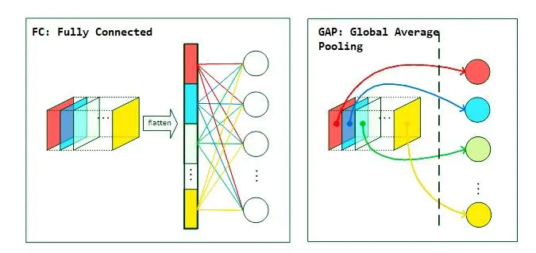
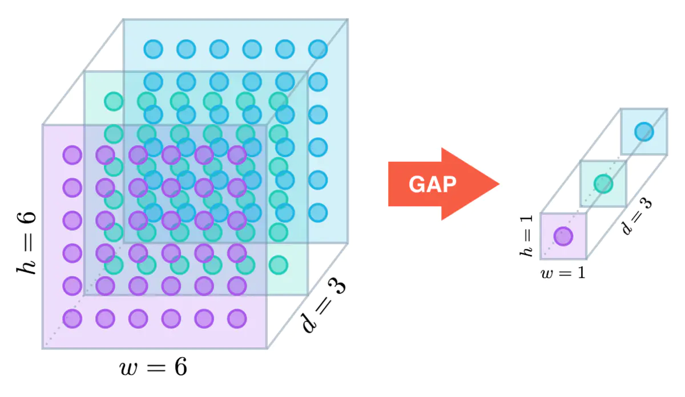

# Global Average Pooling

1. GAP(Global Average Pooling) 适合在图像分类中使用
2. GAP的思路是:
   1. 使用GAP来替代该全连接层(即使用池化层的方式来降维),更
   2. 保留了前面各个卷积层和池化层提取到的空间信息\语义信息

3. **GAP去除了对输入大小的限制**

4. GAP 和全连接层的区别

   1. 全连接层与GAP：

      

5. GAP直接从 feature map 的通道信息中获取结果，若数据集的分类有N种，则最后一层的卷积输出的 feature map 就只有N个通道，对这个 feature map 进行全局池化操作获得长度为N的向量，这就相当于直接赋予了每个通道类别的意义

6. GAP层，通过减少模型中的参数总数来最小化过度拟合，与最大池层类似，减少了张量的维度,属于一种特殊的分类映射方法

7. $$
   h * w * d \rightarrow 1 * 1 * d
   $$