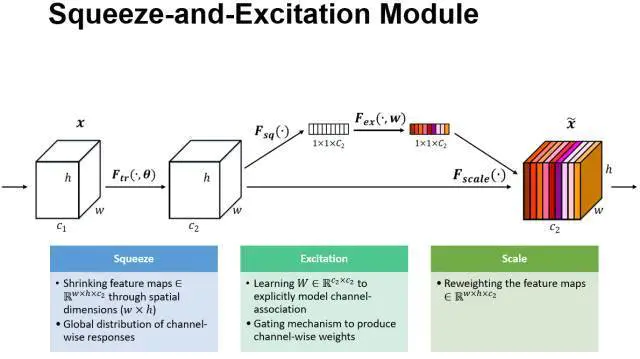
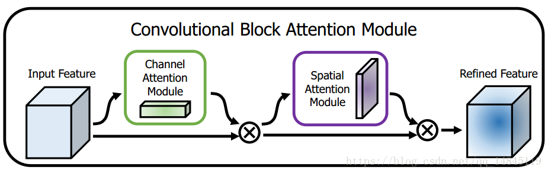
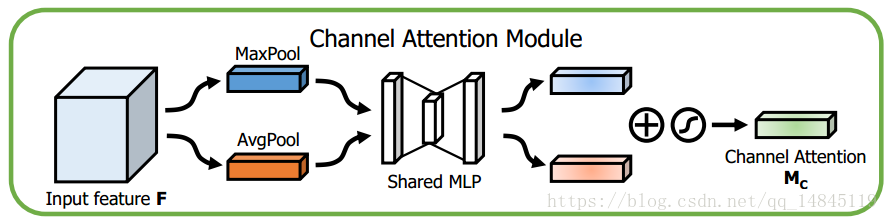
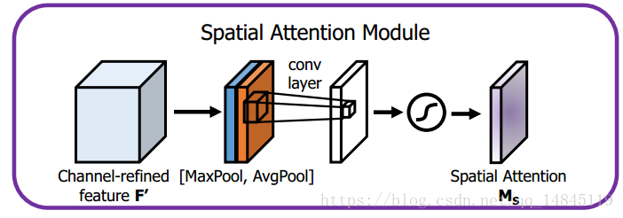
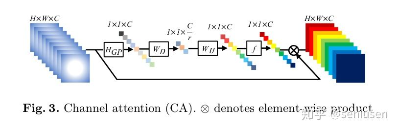
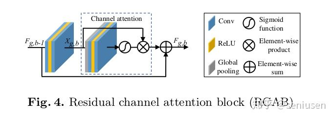

# Attention 机制在CV 中的应用

### 什么是注意力机制

1. 正是加权求和中权重的合理性配置
2.  目前对注意力机制没有很固定的数学描述
3. 所谓Attention机制，便是聚焦于局部信息的机制，比如图像中的某一个图像区域。随着任务的变化，注意力区域往往会发生变化。

### 注意力模块在图像识别中的算法实现

1. SE-NET(**Squeeze-and-Excitation Networks**)

   

   - 由于每个输出单元只能反映其接受野的信息而无法获得此区域之外的背景信息，为减少这一问题，我们提出，将全局空间信息压缩成一个通道描述子， 图中的 $1*1*C_{2}$
   - Squeeze操作,空间维度来进行特征压缩,每个二维的特征通道变成一个实数，这个实数某种程度上具有全局的感受野,并且输出的维度和输入的特征通道数相匹配
   - Excitation操作,是一个类似于循环神经网络中门的机制。通过参数 来为每个特征通道生成权重，其中参数 被学习用来显式地建模特征通道间的相关性。
   - Reweight的操作，我们将Excitation的输出的权重看做是进过特征选择后的每个特征通道的重要性，然后通过乘法逐通道加权到先前的特征上，完成在通道维度上的对原始特征的重标定。

2. CBAM(Convolutional Block Attention Module)

   

   1. 提升CNN 性能的改进角度，从现有工作来看主要集中在（深度、宽度和基数（cardinality））

   2. CBAM 包括两个注意力模块：**通道注意力模块**和**空间注意力模块**

   3. 通道注意力模块：

      

      - 将输入的featuremap，分别经过基于width和height的global max pooling 和global average pooling，然后分别经过MLP，将MLP输出的特征进行基于elementwise的加和操作，经过sigmoid激活操作，生成最终的channel attention featuremap。

   4. 空间注意力模块

      

      - 将Channel attention模块输出的特征图作为本模块的输入特征图。l的global max pooling 和global average pooling，然后将这2个结果基于channel 做concat操作，然后经过一个卷积操作，降维为1个channel。

3. RCAN（残差通道注意力网络）

   1. CA（channel Attention）: 通道注意力机制

      

      整个过程实际上就是对不同通道的特征重新进行了加权分配。$W_D$ 和 $W_u$ 代表下采样和上采样，下采样和上采样层都利用 1×1 的卷积来实现，下采样层的通道数减少 r 倍，激活函数为 Relu，上采样层的激活函数为 Sigmoid。

      2.RCAB (残差通道注意力网络): RCAB 就是将 CA 和残差思想融合在一起。

      

      输入一个特征 input，我们首先进行一个卷积-Relu-卷积操作得到 f，然后 f 再经过一个 CA 模块进行重新缩放得到 x，最后将 x 和 input 相加得到输出特征。其中，卷积操作都采用 3×3 的卷积核。