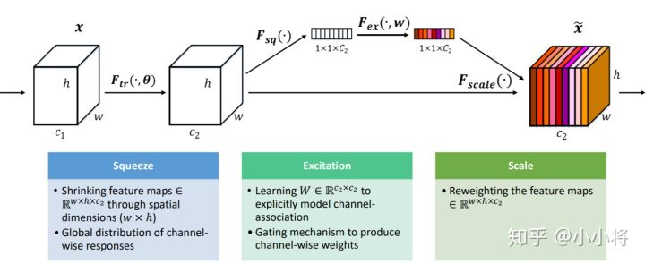
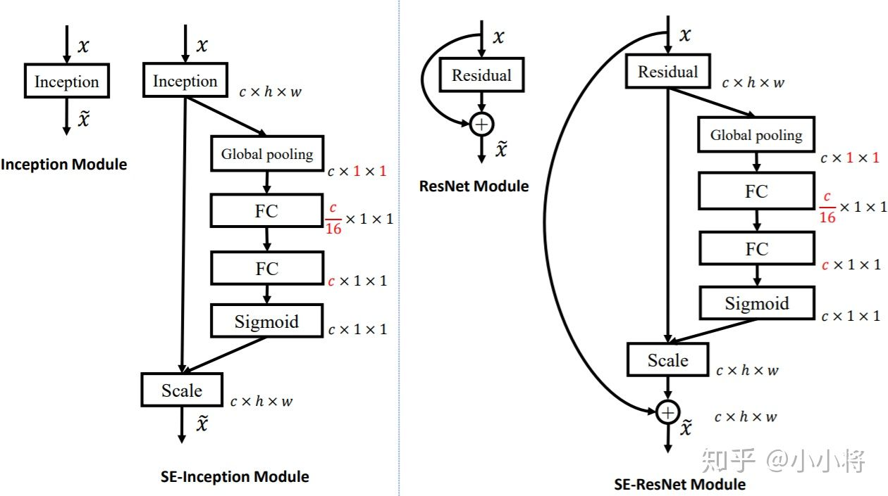

# SE-Net

1. 卷积操作是对一个局部区域进行特征融合，这包括空间上（H和W维度）以及通道间（C维度）的特征融合。
2. 一般 channels 的含义是，每个卷积层中卷积核的数量。卷积操作完成后输出的 out_channels ，**取决于卷积核的数量**。
3. 对channel进行分组也主要是为了使模型更加轻量级，减少计算量。
4. SE-Net网络的创新点在于关注channel之间的关系，希望模型可以自动学习到不同channel特征的重要程度。

### Squeeze-and-Excitation (SE)模块

1. SE模块是在channel维度上做attention或者gating操作
2. SE模块首先对卷积得到的特征图进行Squeeze操作，得到channel级的全局特征，然后对全局特征进行Excitaton操作，学习各个channel间的关系，也得到不同channel的权重，最后乘以原来的特征图得到最终特征。
3. 模型的squeeze 操作实际上是一种空间维度压缩，对每个特征图做全局池化
4. Excitaton 操作实际上是利用权重w来学习C个通道直接的相关性，框架实现中一般使用全连接层或者1*1 卷积层实现，此操作最终实现了提升重要特征对整个学习过程的影响
5. 该过程中对C个通道降维再扩展回C通道。好处就是一方面降低了网络计算量，一方面增加了网络的非线性能力。

### 方法数学推导

1. squeeze的实现

   
   1. 将一个channel上整个空间特征编码为一个全局特征，采用global average pooling来实现
   2. Sequeeze操作得到了全局描述特征

2. Excitation操作

   1. 可以学习到各个channel之间的非线性关系

   2. 学习的关系不是互斥的，能够允许多channel特征

   3. sigmoid形式的gating机制

      

   4. 将学习到的各个channel的激活值（sigmoid激活，值0~1）乘以U上的原始特征

      

   5. 整个操作可以看成学习到了各个channel的权重系数，从而使得模型对各个channel的特征更有辨别能力，这应该也算一种attention机制

### ResNet上的应用

###  总结

SE模块主要为了提升模型对channel特征的敏感性，这个模块是轻量级的，而且可以应用在现有的网络结构中，只需要增加较少的计算量就可以带来性能的提升。