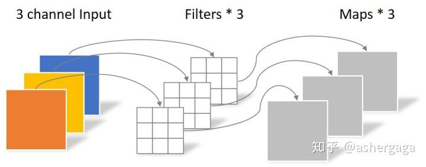
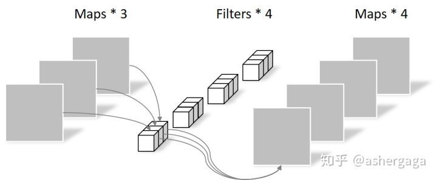
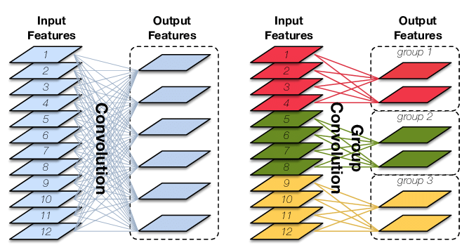
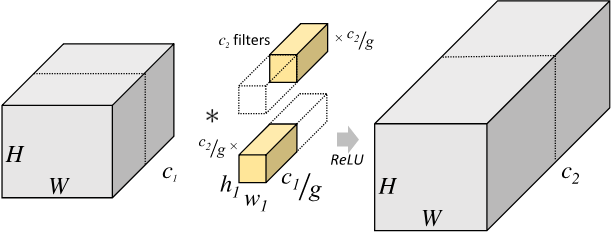

# 几种不同的卷积策略

### 普通卷积

1. 对于一张5×5像素、三通道（shape为5×5×3），经过3×3卷积核的卷积层（假设输出通道数为4，则卷积核shape为3×3×3×4，最终输出4个Feature Map，如果有same padding则尺寸与输入层相同（5×5），如果没有则为尺寸变为3×3

### 深度可分离卷积（Depthwise Convolution）

1. 逐通道卷积：

   1. 一张5×5像素、三通道彩色输入图片（shape为5×5×3），Depthwise Convolution首先经过第一次卷积运算，DW完全是在二维平面内进行。卷积核的数量与上一层的通道数相同（通道和卷积核一一对应）。所以一个三通道的图像经过运算后生成了3个Feature map(如果有same padding则尺寸与输入层相同为5×5)，如下图所示
   2. 没有有效的利用不同通道在相同空间位置上的feature信息。因此需要Pointwise Convolution来将这些Feature map进行组合生成新的Feature map

   

2. Pointwise Convolution的运算与常规卷积运算非常相似，它的卷积核的尺寸为 1×1×M，M为上一层的通道数。所以这里的卷积运算会将上一步的map在深度方向上进行加权组合，生成新的Feature map。有几个卷积核就有几个输出Feature map

   

### 分组卷积

1. **Group Convolution**顾名思义，则是对输入feature map进行分组，然后每组分别卷积。假设输入feature map的尺寸仍为$$C∗H∗WC∗H∗W $$，输出feature map的数量为$$N$$个，如果设定要分成$$G$$个groups，则每组的输入feature map数量为$$\frac CG$$，每组的输出feature map数量为$$\frac NG$$，每个卷积核的尺寸为$$\frac CG∗K∗K$$，卷积核的总数仍为$$N$$个，每组的卷积核数量为$$N/G$$，卷积核只与其同组的输入map进行卷积，卷积核的总参数量为$$N∗\frac CG∗K∗K$$，可见，**总参数量减少为原来的** $$\frac 1G$$，其连接方式如上图右所示，group1输出map数为2，有2个卷积核，每个卷积核的channel数为4，与group1的输入map的channel数相同，卷积核只与同组的输入map卷积，而不与其他组的输入map卷积。

   

2. **减少参数量**，分成$$G$$组，则该层的参数量减少为原来的$$\frac 1 G$$,究竟是如何减少参数数量的呢？将输入特征图按照通道数分成$$g$$组，则每组输入特征图的尺寸为$$H * W * \frac {C_{1}}{g}$$,对应的卷积核尺寸为$$h * w * \frac {C_{1}}{g}$$,每组输出特征图尺寸为$$H * W * \frac {C_{2}}{g}$$,将$g$ 组结果拼接(concat),得到最终尺寸为 $H * W * c_{2}$的输出特征图。分组卷积层的参数量为
   $$
   h_1 * w_1  * (\frac {c_{1}}{g})  *  (\frac {c_{2}}{g})  * g = h_1 * w_1 * c_1 * c_2 * \frac {1}{g}
   $$
   

3. 当分组数量等于输入map数量，输出map数量也等于输入map数量，即$$G=N=C$$、$$N$$个卷积核每个尺寸为1∗K∗K1∗K∗K时，Group Convolution就成了**Depthwise Convolution**，参见[MobileNet](https://arxiv.org/abs/1704.04861)和[Xception](https://arxiv.org/abs/1610.02357)等，**参数量进一步缩减**，如下图所示:

   