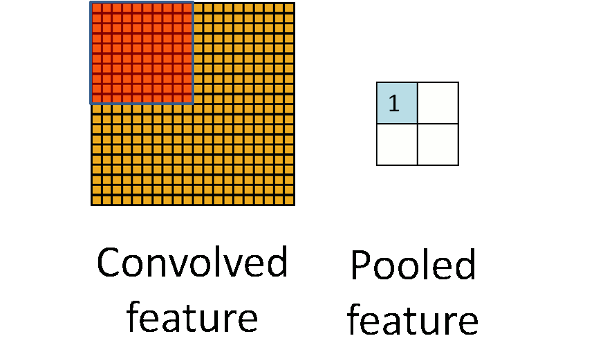
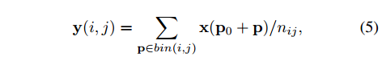
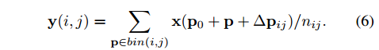

# 实例分割综述

文章从背景，问题描述，方法及方法的演变，数据集以及最新的SOTA算法分析 这几个方面对实例分割进行了描述

### 自上而下的分割方法（先Detection 再 Segmentation）

1. 论文提到，分割算法中，对检测器最重要的就是**特征描述方法**，而类似的特征描述算法在目标检测算法中可以说是最为重要的

2. 许多年前，为了区分图像中差异较大的部分，人们将研究中心放在了 **局部描述子**上（SIFT & HOG）然后再对描述子进行分组和总结为更高级的描述。

3. 这些特征描述方法需要手工设计，这个过程需要很多领域的专业知识交叉才能实现

4. 文中提到，早期人们对模型的改进主要是增加网络深度，但是网络深度增加会导致模型的参数变多，计算效率变低，后期网络则在增加深度的同时，避免使用全连接层，在一定程度上减少了参数数量。

5. 对于不同尺度的目标检测也是一个很大的挑战，为了解决这个问题，提出了图像金字塔（pyramid of images），但是泰国耗费资源

6. **对于小目标的分割问题**，这几年提出了下采样和多尺度金字塔去解决，但是这样做会导致特征分辨率过低和图像细节丢失。

7. 低层的CNN网络层的感受野更小，对图像语义的感知程度不足。

8. 物体的语义特征主要取决于物体的尺寸，较小的物体在底层的CNN中较少，在高层cnn中可能会消失不见，这使得对小目标的语义或实例分割相当困难

   ##### 怎么解决小目标的分割问题？

   1. 空洞卷积
   2. 提高特征分辨率

   这两个方法都会提高算法的计算复杂度

9. **对于几何变换问题**，深度卷积网络如果没有特殊的处理，无法保证对图像特征的几何变换的空间不变性

   **如何解决？**

   ​	1. 局部最大池化（Local max pooling）

   ​	

10. **对遮挡问题的处理**，遮挡会导致物体实例的语义信息缺失，对此问题人们提出了**deformable ROI pooling**   和 **deformable convolution**  ，以及提出了使用对抗网络的形式，让模型对遮挡问题更加具有适应性。

    这里解释一下什么是**deformable  ROI Pooling** 和 **deformable convolution**  

    ​		   1. 池化来降低卷积层输出的特征向量，同时改善结果可以一定程度上防止过拟合

    2. **ROI Pooling**， 由ROI(Region of interest) pooling 演变而来，ROI pooling层根据RPN层生成的ROI框的坐标值从feature map 中提取相应的区域，然后对区域进行一个输出维度统一的pooling操作，下图展示了普通的pooling操作

    
    $$
    n_{i,j} \quad 表示坐标ij处的像素总数  \\
    P_{0} + P \quad 代表采样点的坐标
    $$
    

    3. **deformable ROI Pooling ** ,ROI 过程与上面相同，不同的是在Pooling 过程中加入了一个坐标的变换过程
    4. **deformable convolution**  ，类似于在ROI 采样过程中加入位移变量，可变卷积也是在卷积操作上加入位移变量，相当于卷积核的每个方块可以伸缩变化，动态的改变感受野范围

11. 图像噪声问题：现实场景中的图像噪声来源可能有多种，如光照，相机拍摄质量，图像后期压缩等，低质量的图像可能会影响到分割过程

    