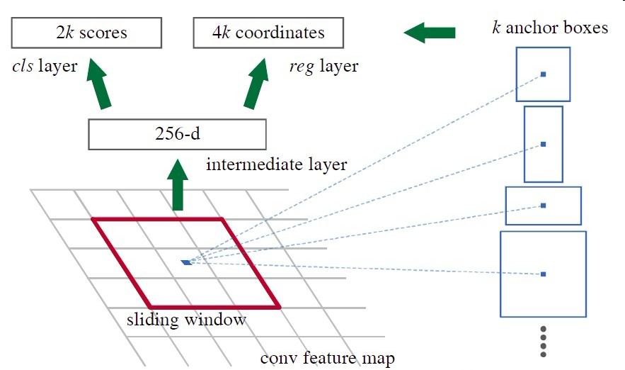

# MaskRcnn 论文解析

### 特点：

1. 通用 Instance Segamention
2. 同时进行分类，检测框预测和mask生成
3. 两阶段检测方法

### BACKBONE

1. RES -NET 
2. 

### FPN

1. fpn 用于提取res-net 上生成的不同阶段的信息，生成不同规模的Feature-map
2. Feature map将被用于生成候选框

### RPN(区域生成网络)

1. 用于提取检测框的候选框

2. 首先通过一系列卷积得到公共特征图，假设他的大小是N x 16 x 16，然后我们进入RPN阶段，首先经过一个3 x 3的卷积，得到一个256 x 16 x 16的特征图，也可以看作16 x 16个256维特征向量，然后经过两次1 x 1的卷积，分别得到一个18 x 16 x 16的特征图，和一个36 x 16 x 16的特征图，也就是16 x 16 x 9个结果，每个结果包含2个分数和4个坐标，再结合预先定义的Anchors，经过后处理，就得到候选框；整个流程如图

3. MaskRcnn的底层使用RPN实现候选框生成的过程

4. RPN 使用CNN 生成候选框

   
   $$
   O = (n + 2*p - f)/s + 1
   $$

5. 对RPN 找到的候选框进行分类定位与微调，并生成Mask
6. 生成的特征图中的每个像素都代表了原图中的一个区域（因为使用了ROI Align）
7. RPN 的作用可以总结为确定特征图中的物体的中心点的位置，然后再根据中心点位置和特征图生成不同的候选框，将此结果传递到下一阶段进行候选框的微调

### Anchor

1. 根据feature MAP 上的点和ratio，scale 生成不同的候选框
2. scale 用于判断feature Map的尺寸， scale 用于确定候选框的长宽比
3. FPN 

### ROI Align

1. 一种区域特征聚集方式, 很好地解决了ROI Pooling操作中两次量化造成的区域不匹配(mis-alignment)的问题

